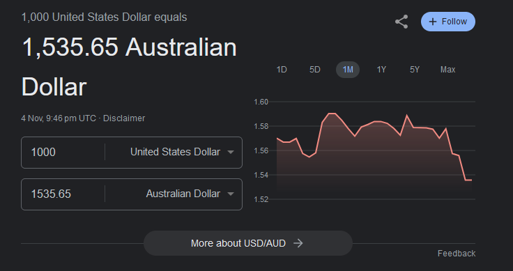
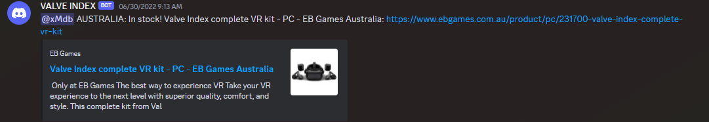

# vr-puppet: Puppeteer and Discord Webhook Alert Combo

I created this project in 2022 to alert me of any stock of the Valve Index Full Kit, which is exclusive to EB Games in Australia/NZ and is very hard to find stock of. It is also $2,000 AUD, whereas in North America it is $1,000 USD 😟

The script uses a headless browser known as Puppeteer to scrape the EB Games AU and NZ websites to detect if it is out of stock.

Although the website is protected with Cloudflare bot and scraper detectors, by installing puppeteer-extra and puppeteer-extra-plugin-stealth, it is easily bypassed.

If the website does not mention "out of stock", an alert is sent every 5 minutes to a Discord webhook that alerts me of the change.

After running this project for a while on my own server, I finally got an alert that it was available in late 2022, and I purchased it!

